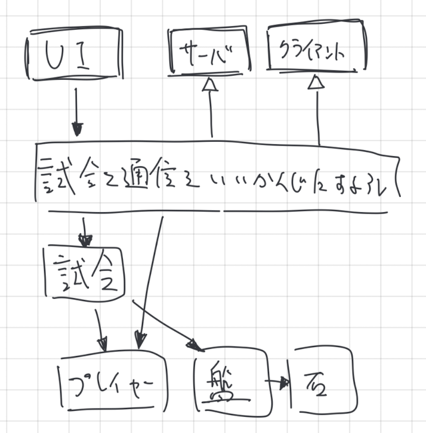
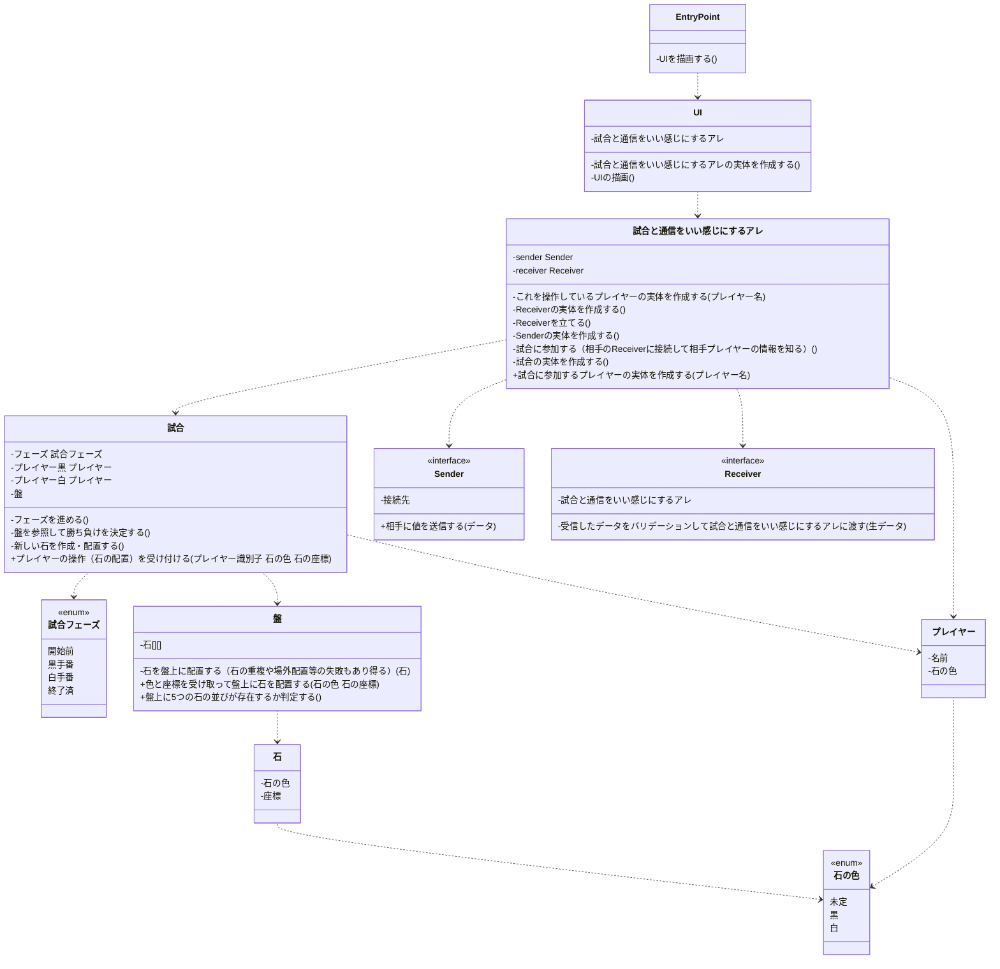

## 落書き

## クラス図

## 文字起こし

### Example

これは例です

#### データ

クラスが持つデータを書きます

#### メソッド

クラスが持つプライベートなメソッドです

#### インターフェイス

クラスを操作するときのインターフェイス（=パブリックなメソッド）です

### UI

ユーザインターフェイス

#### データ

- 試合と通信をいい感じにするアレ

#### メソッド

- 試合と通信をいい感じにするアレの実体を作成する

### 試合と通信をいい感じにするアレ

#### データ

- Receiver（抽象）
- Sender（抽象）

#### メソッド

- これを操作しているプレイヤーの実体を作成する
- サーバの実体を作成する
- サーバを立てる
- クライアントの実体を作成する
- 試合に参加する（サーバに接続して相手プレイヤーの情報を知る）
- 試合の実体を作成する

#### インターフェイス

- 試合に参加するプレイヤーの実体を作成する

### Receiver（抽象）

#### データ

- 試合と通信をいい感じにするアレ

#### メソッド

- 受信したデータをバリデーションして試合と通信をいい感じにするアレに渡す

#### インターフェイス

### Sender（抽象）

#### データ

- 接続先

#### メソッド

#### インターフェイス

- 相手に値を送信する

### 試合

試合実体

#### データ

- フェーズ
  - 開始前
  - 黒手番
  - 白手番
  - 終了済
- プレイヤー黒
- プレイヤー白
- 盤

#### メソッド

- フェーズを進める
- 盤を参照して勝ち負けを決定する
- 新しい石を作成・配置する

#### インターフェイス

- プレイヤーの操作（石の配置）を受け付ける

### 盤

五目並べを行なうフィールド

#### データ

- 石（HashMapで持つのが良い）

#### メソッド

- 石を盤上に配置する（石の重複や場外配置等の失敗もあり得る）

#### インターフェイス

- 色と座標を受け取って盤上に石を配置する
- 盤上に5つの石の並びが存在するか判定する

### 石

五目並べの石

#### データ

- 色
  - 黒
  - 白

#### メソッド

#### インターフェイス

### プレイヤー

五目並べで対戦するプレイヤー

#### データ

- 名前
- 石の色
  - 黒
  - 白

#### メソッド

#### インターフェイス
