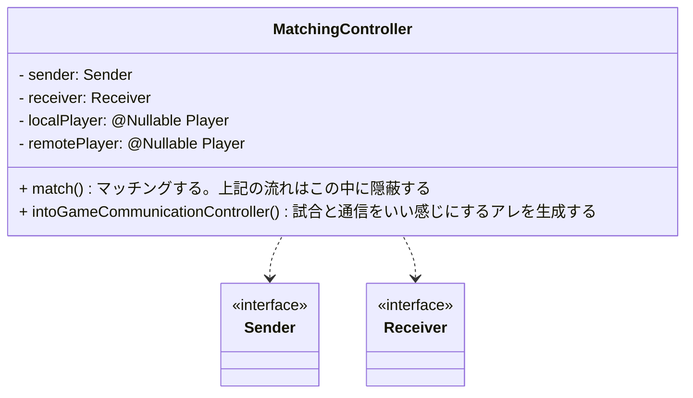

# マッチングをするやつ

## マッチングの流れ

DHCPっぽいことをする

1. Discover マッチングしませんかー
2. Offer いいですよー
3. Request 私のプレイヤー情報はこれ
4. Ack わかりました 私のプレイヤー情報はこれ

## アーキテクチャ

```mermaid
classDiagram
  direction BT
  class MatchingController {
    - sender: Sender
    - receiver: Receiver
    - localPlayer: @Nullable Player
    - remotePlayer: @Nullable Player
    + match() マッチングする。上記の流れはこの中に隠蔽する
    + intoGameCommunicationController() 試合と通信をいい感じにするアレを生成する
  }
  Sender <.. MatchingController
  Receiver <.. MatchingController
  class Sender {
    <<interface>>
  }
  class Receiver {
    <<interface>>
  }
```
